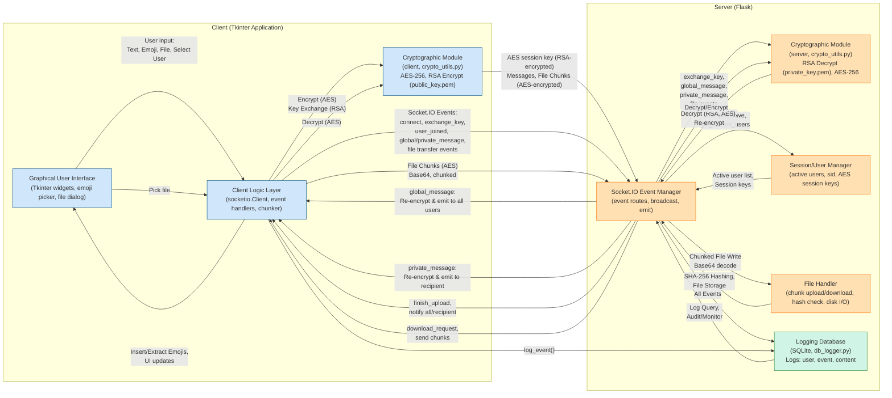
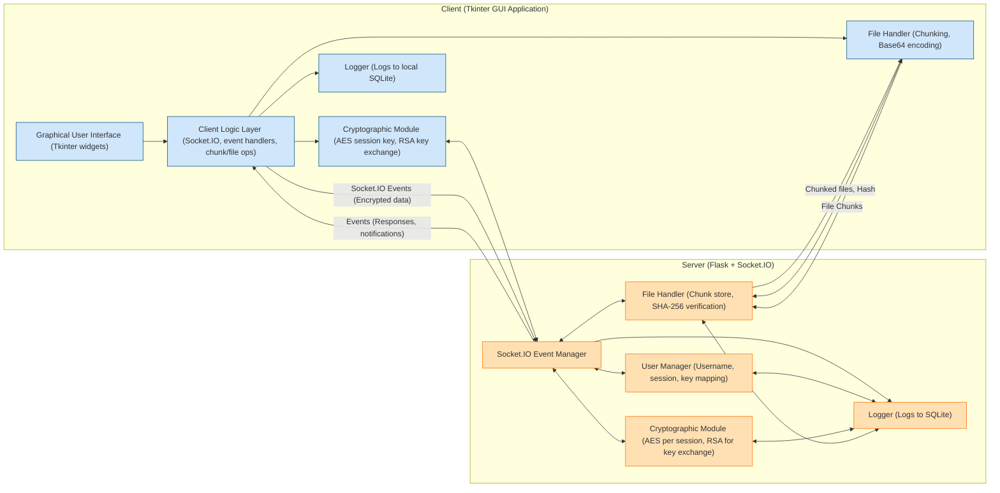

# FUV Secure Real-Time Chatroom

A secure, multi-user real-time chatroom application built with Python, featuring robust encryption, public/private messaging, file sharing, emoji support, and a modern GUI.

---

## Table of Contents
1. 🌟 [Features & Functional Requirements](#features--functional-requirements)
2. 🏗️ [Architecture Overview](#architecture-overview)
3. 💾 [Installation](#installation)
4. 💬 [Usage](#usage)
5. ⚖️ [Strengths & Limitations](#strengths--limitations)
6. 🔮 [Future Work](#future-work)
7. 🎓 [Acknowledgements & References](#acknowledgements--references)

---

## Features & Functional Requirements

The application delivers all essential capabilities for a secure, modern chatroom:

| #  | Feature                  | Description                                                                                 |
|----|--------------------------|---------------------------------------------------------------------------------------------|
| 1  | 🔐 User Authentication   | Prompts for a unique username; enforces uniqueness across all connected users.              |
| 2  | 🌐 Public Messaging      | Broadcasts encrypted messages to all users in real time.                                   |
| 3  | 🤝 Private Messaging     | Enables sending encrypted messages to selected users only.                                  |
| 4  | 🧑‍🤝‍🧑 Active User List  | Displays a live list of all currently connected users.                                      |
| 5  | 🖥️ GUI Interface         | Provides an intuitive, modern chat interface with status and error displays.                |
| 6  | 🧵 Concurrent Connections| Server supports multiple simultaneous users via threading.                                  |
| 7  | 📎 File Sharing          | Allows sending and receiving files with confirmation dialogs and progress indicators.        |
| 8  | 😄 Emoji Support         | Lets users add emojis using a visual picker or shortcode commands (e.g., `:smile:`).        |
| 9  | ⏰ Message Timestamps    | Shows the time of each message in `HH:MM:SS` format.                                       |
| 10 | 🛡️ Message Encryption    | Encrypts all messages and files using AES-256 symmetric encryption.                        |
| 11 | ✅ Graceful Exit & Errors| Handles disconnects, invalid input, and network failures with user-friendly feedback.       |

### Detailed Functional Instructions

1. **User Authentication**:  
   - Prompt for a username at startup.
   - Server maintains list of active usernames and enforces uniqueness.
   - Duplicate usernames are rejected with error popups.

2. **Public Messaging**:  
   - Messages are sent by clients and broadcast to all users by the server.
   - All public messages are encrypted, timestamped, and shown as `(Global) (HH:MM:SS) message`.

3. **Private Messaging**:  
   - Users can select a recipient or type `/w username message`.
   - Server routes private (encrypted) messages only to the selected client.

4. **Active User List**:  
   - GUI displays all connected users and updates automatically on join/leave.

5. **GUI Interface**:  
   - Scrollable message window, user list, input box.
   - Buttons for send, emoji, file upload.
   - Color-coded message types and error/info display.

6. **Concurrent Connections**:  
   - Server uses threads to handle multiple users.
   - Clients listen for messages in the background.

7. **File Sharing**:  
   - GUI allows file selection and sending.
   - Files are sent in encrypted chunks, with hash verification and progress.
   - Recipients are prompted to accept or reject downloads.

8. **Emoji Support**:  
   - Emojis can be inserted using a picker or typing shortcodes like `:smile:`.
   - Emoji mapping (shortcode to Unicode) handled by `emoji_dict.py`.

9. **Message Timestamps**:  
   - Each message is timestamped before encryption and displayed in the GUI.

10. **Message Encryption**:  
    - All messages/files are encrypted with AES before sending.
    - Keys are never printed or logged.

11. **Graceful Exit and Errors**:  
    - On exit, clients notify server, and users are removed from the list.
    - Server notifies all clients of disconnects.
    - All exceptions are handled and logged; GUI provides user-friendly notifications.

---

## Architecture Overview

- **Client:**  
  Python Tkinter GUI application (`CLIENT/gui.py`). Handles all user interaction, sends/receives messages and files, and manages encryption/decryption.
- **Server:**  
  Python Flask server (`SERVER/server.py`) using Flask-SocketIO for event-driven communication, user management, message/file routing, and server-side encryption.
- **Encryption:**  
  Hybrid cryptography: Initial RSA key exchange secures a per-session AES-256 key, which is then used for all data encryption/decryption.
- **Logging:**  
  Persistent event and error logging to SQLite (`LOGS/db_logger.py`), accessible with a log viewer.
- **Emoji System:**  
  Shortcode-to-Unicode mapping (`CLIENT/emoji_dict.py`) and a visual emoji picker in the client GUI.

### Project Structure
```
FUV-CHATROOM/
├── CLIENT/
│   ├── gui.py
│   ├── emoji_dict.py
│   ├── public_key.pem
├── SERVER/
│   ├── server.py
│   ├── crypto_utils.py
│   ├── private_key.pem
│   ├── public_key.pem
│   ├── upload_files/
├── LOGS/
│   ├── db_logger.py
│   ├── chat_logs.db
│   ├── view_logs.py
├── requirements.txt
├── rsa_key_generator.py  
```
### Component Diagram 

### Flow Diagram


---

### Key Components

#### Client-Side (`CLIENT/gui.py`)

##### GUI (Tkinter)
- Implements a modern, resizable window with:
  - Chat history pane
  - Input field
  - User list
  - Emoji picker
  - File upload button
  - System/error notifications
- Components update dynamically as events occur.

##### Encryption (AES, RSA)
- On first connect, the client generates a unique AES-256 key.
- The AES key is encrypted with the server's RSA public key and exchanged securely.
- All chat and file data are encrypted and decrypted transparently.

##### Messaging Logic
- Outgoing messages are timestamped, encrypted, and routed via Socket.IO.
- Incoming messages are decrypted, parsed for emojis, and displayed in the chat window.

##### Emoji System
- Uses `emoji_dict.py` to map shortcodes (e.g., `:smile:`) to Unicode emojis.
- Emoji picker is fully integrated and easily extensible.

##### File Sharing
- Files are split into 48KB chunks, base64-encoded, and sent with integrity hashes.
- Progress bars and acceptance prompts provide user feedback and control.

##### Error Handling
- All actions are wrapped with `try/except` blocks, and errors are logged.
- The GUI displays user-friendly messages on failure.

---

#### Server-Side (`SERVER/server.py`)

##### `Socket.IO` Event Server
- Manages client connections, user sessions, and event-driven communication.
- Uses threads for concurrent handling of multiple clients.

##### Authentication & Session Management
- Validates and enforces unique usernames.
- Maintains an up-to-date user list and broadcasts join/leave events to all clients.

##### Message Routing & Encryption
- Receives encrypted messages, decrypts them, and re-encrypts for each recipient using their unique AES key.
- Ensures only intended clients can read their messages.

##### File Handling
- Receives file chunks, reconstructs and verifies files, then serves them to recipients.
- Includes SHA-256 hashing for end-to-end data integrity.

##### Logging
- All events, errors, and system actions are logged to SQLite for auditing or debugging.

##### Graceful Disconnection
- Updates the user list and informs all clients when users disconnect or failures occur.


---

## 💾 Installation

### 1. Clone the Repository
```bash
git clone https://github.com/<your-username>/fuv-chatroom.git
cd fuv-chatroom
```
### 2. Install Python Dependencies
- Make sure you have Python 3.8+ installed.
- Install all necessary packages (server and client use a shared requirements.txt):

```bash
pip install -r requirements.txt
```
### 3. Generate RSA Keys (First Time Only)
To enable secure encryption, you must generate RSA key pairs for the server and client.
You can do this automatically using the provided script:

```bash
python rsa_key_generator.py
```
- This script creates:
  - ./server/private_key.pem (Server's private key)
  - ./client/public_key.pem (Client's public key)

If the directories do not exist, please create them or update the script paths as needed.

Note: If you run into a No such file or directory error, create the server/ and client/ folders:

```bash
mkdir server client
```
### 4. Start the Server
Open a terminal window and run:

```bash
cd SERVER
python server.py
```
The server will start and listen for connections on http://localhost:8080.

### 5. Start the Client(s)
Open a new terminal for each client you want to run (you can test multiple clients on one computer):

```bash
cd CLIENT
python gui.py
```
- Each client will launch a chat window.
- You can run as many clients as you like (just repeat the above step in separate terminals).

### 6. Usage Notes
- When prompted, enter a unique username for each client.
- For local testing, run both server and client(s) on the same machine.
- All chat and file traffic is encrypted.
- See the [Usage](#usage) section below for more info on sending messages, sharing files, and using emojis.

- **Tip**:
To simulate a real chat, keep at least two terminals open:
  - One for the server (python server.py)
  - One or more for clients (python gui.py in each)
>If you encounter any issues, ensure your keys are correctly placed and that all dependencies are installed.
---
## 💬 Usage

- **Login:** Enter a unique username (duplicate names are rejected).
- **Send public messages:** Type in the message box and press Enter.
- **Send private messages:** Type `/w username your message` or select a user in the user list.
- **File sharing:** Click 📎 to choose a file, then send; recipients are prompted to download.
- **Insert emojis:** Click 😊 for the picker, or type `:smile:` in your message.
- **View user list:** Check the active user panel for current participants.
- **Exit:** Simply close the window; the system notifies all users and updates the list.

---

## ⚖️Strengths & Limitations

### Strengths

- Complete core functionality for a modern secure chatroom.
- Strong encryption for all communications.
- Intuitive GUI, emoji support, and robust error handling.
- Persistent logging and real-time user list.

### Limitations

- **Scalability:** Designed for small/medium groups; threading model not suitable for large-scale use.
- **File sharing:** Limited to common types and max size (20MB).
- **GUI:** Functional but could be modernized.
- **Encryption:** Introduces minor latency for large files.

---

## 🔮 Future Work

- Refactor to support async/multi-process/concurrent models for higher scalability.
- Transition to cloud hosting for broader accessibility.
- Expand file sharing features: support more types, compression, and chunked uploads.
- Enhance GUI design, accessibility, and user customization.
- Optimize encryption routines for lower latency.

---

## 🎓 Acknowledgements & References

This project was developed as part of the Independent Study in Computer Networks at FUV - Summer 2025, which is built on the foundations laid by Kurose & Ross's *Computer Networking: A Top-Down Approach*. We want to say a special thanks to Professor Dang Huynh for his guidance and support throughout the project.

### **References:**
- Miguel Grinberg, [Flask-SocketIO Documentation](https://flask-socketio.readthedocs.io/)
- Kurose & Ross, *Computer Networking: A Top-Down Approach*, Pearson, 8th edition
- [Python Cryptography Authority](https://cryptography.io/en/latest/)
- [Tkinter Documentation](https://docs.python.org/3/library/tkinter.html)
